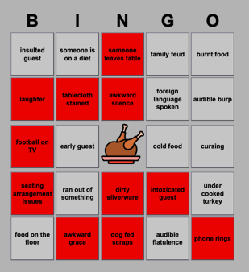
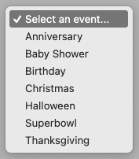
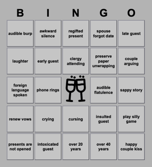
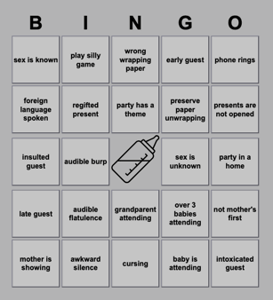
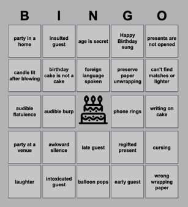
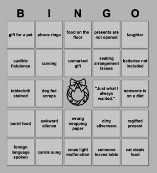
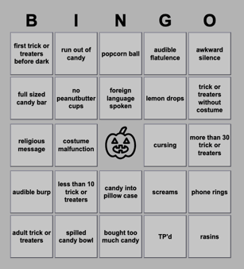
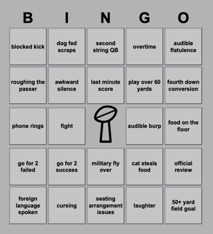
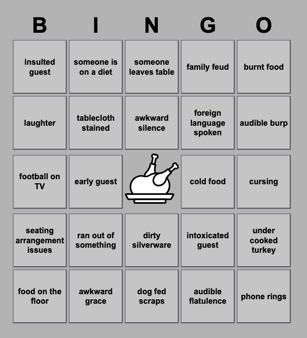

### Party Bingo

---

Small set of web files hosted over HTTP provide a funny random BINGO card to each guest.

---

* bingo.appcache
	* Ask browser to load all files.
* bingo.css
	* Style for rendered components.
* bingo.html
	* Scaffolding for the user interface.
* bingo.js
	* User interface control.
* event.js
	* User interface construction for events.

---

* Example Play
	* 

---

* Choose...
	* 
* Anniversary
	* 
* Baby Shower
	* 
* Birthday
	* 
* Christmas
	* 
* Halloween
	* 
* Superbowl
	* 
* Thanksgiving
	* 

---
